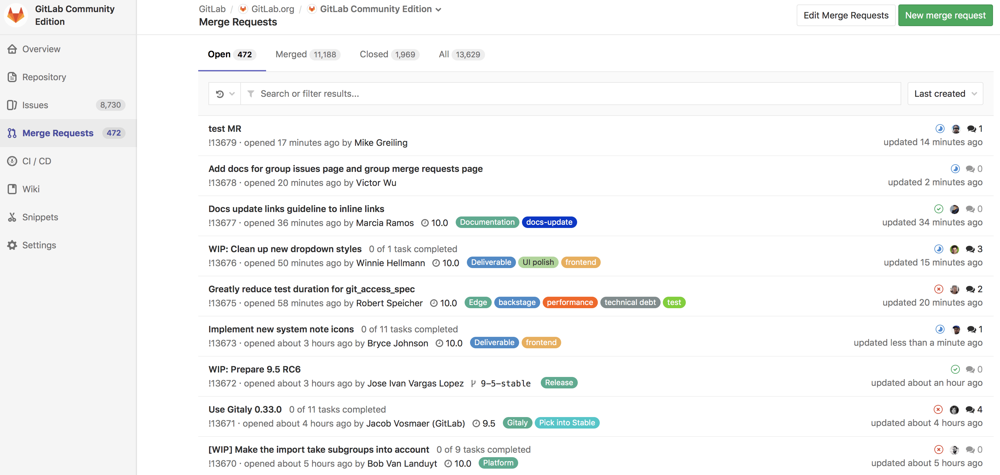
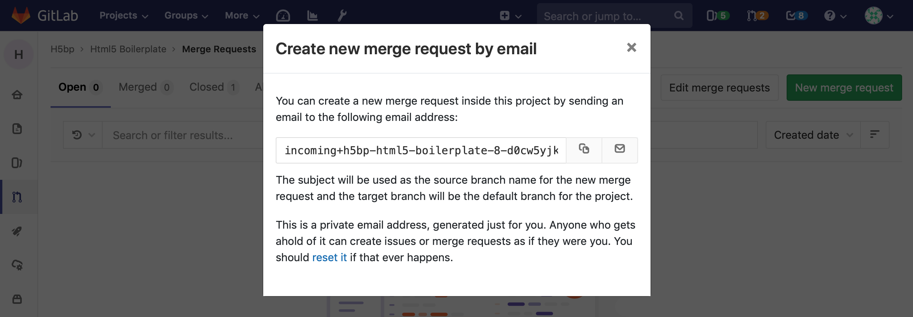

# Merge requests

Merge requests allow you to exchange changes you made to source code and
collaborate with other people on the same project.


## Overview

A Merge Request (**MR**) is the basis of GitLab as a code collaboration
and version control platform.
Is it simple as the name implies: a _request_ to _merge_ one branch into another.

With GitLab merge requests, you can:

- Compare the changes between two [branches](https://git-scm.com/book/en/v2/Git-Branching-Branches-in-a-Nutshell#_git_branching)
- [Review and discuss](../../discussions/index.md#discussions) the proposed modifications inline
- Live preview the changes when [Review Apps](../../../ci/review_apps/index.md) is configured for your project
- Build, test, and deploy your code in a per-branch basis with built-in [GitLab CI/CD](../../../ci/README.md)
- Prevent the merge request from being merged before it's ready with [WIP MRs](#work-in-progress-merge-requests)
- View the deployment process through [Pipeline Graphs](../../../ci/pipelines.md#pipeline-graphs)
- [Automatically close the issue(s)](../../project/issues/closing_issues.md#via-merge-request) that originated the implementation proposed in the merge request
- Assign it to any registered user, and change the assignee how many times you need
- Assign a [milestone](../../project/milestones/index.md) and track the development of a broader implementation
- Organize your issues and merge requests consistently throughout the project with [labels](../../project/labels.md)
- Add a time estimation and the time spent with that merge request with [Time Tracking](../../../workflow/time_tracking.html#time-tracking)
- [Resolve merge conflicts from the UI](#resolve-conflicts)
- Enable [fast-forward merge requests](#fast-forward-merge-requests)
- Enable [semi-linear history merge requests](#semi-linear-history-merge-requests) as another security layer to guarantee the pipeline is passing in the target branch
- [Create new merge requests by email](#create-new-merge-requests-by-email)
- Allow maintainers of the target project to push directly to the fork by [allowing edits from maintainers](maintainer_access.md)

With **[GitLab Enterprise Edition][ee]**, you can also:

- View the deployment process across projects with [Multi-Project Pipeline Graphs](https://docs.gitlab.com/ee/ci/multi_project_pipeline_graphs.html#multi-project-pipeline-graphs) **[PREMIUM]**
- Request [approvals](https://docs.gitlab.com/ee/user/project/merge_requests/merge_request_approvals.html) from your managers **[STARTER]**
- [Squash and merge](https://docs.gitlab.com/ee/user/project/merge_requests/squash_and_merge.html) for a cleaner commit history **[STARTER]**
- Analyze the impact of your changes with [Code Quality reports](https://docs.gitlab.com/ee/user/project/merge_requests/code_quality_diff.html) **[STARTER]**

## Use cases

A. Consider you are a software developer working in a team:

1. You checkout a new branch, and submit your changes through a merge request
1. You gather feedback from your team
1. You work on the implementation optimizing code with [Code Quality reports](https://docs.gitlab.com/ee/user/project/merge_requests/code_quality_diff.html) **[STARTER]**
1. You build and test your changes with GitLab CI/CD
1. You request the approval from your manager
1. Your manager pushes a commit with his final review, [approves the merge request](https://docs.gitlab.com/ee/user/project/merge_requests/merge_request_approvals.html), and set it to [merge when pipeline succeeds](#merge-when-pipeline-succeeds) (Merge Request Approvals are available in GitLab Starter)
1. Your changes get deployed to production with [manual actions](../../../ci/yaml/README.md#manual-actions) for GitLab CI/CD
1. Your implementations were successfully shipped to your customer

B. Consider you're a web developer writing a webpage for your company's:

1. You checkout a new branch, and submit a new page through a merge request
1. You gather feedback from your reviewers
1. Your changes are previewed with [Review Apps](../../../ci/review_apps/index.md)
1. You request your web designers for their implementation
1. You request the [approval](https://docs.gitlab.com/ee/user/project/merge_requests/merge_request_approvals.html) from your manager **[STARTER]**
1. Once approved, your merge request is [squashed and merged](https://docs.gitlab.com/ee/user/project/merge_requests/squash_and_merge.html), and [deployed to staging with GitLab Pages](https://about.gitlab.com/2016/08/26/ci-deployment-and-environments/) (Squash and Merge is available in GitLab Starter)
1. Your production team [cherry picks](#cherry-pick-changes) the merge commit into production

## Merge requests per project

View all the merge requests within a project by navigating to **Project > Merge Requests**.

When you access your project's merge requests, GitLab will present them in a list,
and you can use the tabs available to quickly filter by open and closed. You can also [search and filter the results](../../search/index.md#issues-and-merge-requests-per-project).



## Merge requests per group

View merge requests in all projects in the group, including all projects of all descendant subgroups of the group. Navigate to **Group > Merge Requests** to view these merge requests. This view also has the open and closed merge requests tabs.

You can [search and filter the results](../../search/index.md#issues-and-merge-requests-per-group) from here.


## Removing the source branch

When creating a merge request, select the "Remove source branch when merge
request accepted" option and the source branch will be removed when the merge
request is merged.

This option is also visible in an existing merge request next to the merge
request button and can be selected/deselected before merging. It's only visible
to users with [Master permissions](../../permissions.md) in the source project.

If the user viewing the merge request does not have the correct permissions to
remove the source branch and the source branch is set for removal, the merge
request widget will show the "Removes source branch" text.


## Authorization for merge requests

There are two main ways to have a merge request flow with GitLab:

1. Working with [protected branches][] in a single repository
1. Working with forks of an authoritative project

[Learn more about the authorization for merge requests.](authorization_for_merge_requests.md)

## Cherry-pick changes

Cherry-pick any commit in the UI by simply clicking the **Cherry-pick** button
in a merged merge requests or a commit.

[Learn more about cherry-picking changes.](cherry_pick_changes.md)

## Semi-linear history merge requests

A merge commit is created for every merge, but the branch is only merged if
a fast-forward merge is possible. This ensures that if the merge request build
succeeded, the target branch build will also succeed after merging.

Navigate to a project's settings, select the **Merge commit with semi-linear
history** option under **Merge Requests: Merge method** and save your changes.

## Fast-forward merge requests

If you prefer a linear Git history and a way to accept merge requests without
creating merge commits, you can configure this on a per-project basis.

[Read more about fast-forward merge requests.](fast_forward_merge.md)

## Merge when pipeline succeeds

When reviewing a merge request that looks ready to merge but still has one or
more CI jobs running, you can set it to be merged automatically when CI
pipeline succeeds. This way, you don't have to wait for the pipeline to finish
and remember to merge the request manually.

[Learn more about merging when pipeline succeeds.](merge_when_pipeline_succeeds.md)

## Resolve discussion comments in merge requests reviews

Keep track of the progress during a code review with resolving comments.
Resolving comments prevents you from forgetting to address feedback and lets
you hide discussions that are no longer relevant.

[Read more about resolving discussion comments in merge requests reviews.](../../discussions/index.md)

## Resolve conflicts

When a merge request has conflicts, GitLab may provide the option to resolve
those conflicts in the GitLab UI.

[Learn more about resolving merge conflicts in the UI.](resolve_conflicts.md)

## Create new merge requests by email

*This feature needs [incoming email](../../../administration/incoming_email.md)
to be configured by a GitLab administrator to be available for CE/EE users, and
it's available on GitLab.com.*

You can create a new merge request by sending an email to a user-specific email
address. The address can be obtained on the merge requests page by clicking on
a **Email a new merge request to this project** button.  The subject will be
used as the source branch name for the new merge request and the target branch
will be the default branch for the project. The message body (if not empty)
will be used as the merge request description. You need
["Reply by email"](../../../administration/reply_by_email.md) enabled to use
this feature. If it's not enabled to your instance, you may ask your GitLab
administrator to do so.



## Find the merge request that introduced a change

> **Note**: this feature was [implemented in GitLab 10.5](https://gitlab.com/gitlab-org/gitlab-ce/issues/2383).

When viewing the commit details page, GitLab will link to the merge request (or
merge requests, if it's in more than one) containing that commit.

This only applies to commits that are in the most recent version of a merge
request - if a commit was in a merge request, then rebased out of that merge
request, they will not be linked.

[Read more about merge request versions](versions.md)

## Revert changes

GitLab implements Git's powerful feature to revert any commit with introducing
a **Revert** button in merge requests and commit details.

[Learn more about reverting changes in the UI](revert_changes.md)

## Merge requests versions

Every time you push to a branch that is tied to a merge request, a new version
of merge request diff is created. When you visit a merge request that contains
more than one pushes, you can select and compare the versions of those merge
request diffs.

[Read more about merge request versions](versions.md)

## Work In Progress merge requests

To prevent merge requests from accidentally being accepted before they're
completely ready, GitLab blocks the "Accept" button for merge requests that
have been marked as a **Work In Progress**.

[Learn more about settings a merge request as "Work In Progress".](work_in_progress_merge_requests.md)

## Merge request diff file navigation

The diff view has a persistent dropdown for file navigation. As you scroll through
diffs with a large number of files and/or many changes in those files, you can
easily jump to any changed file through the dropdown navigation.


## Ignore whitespace changes in Merge Request diff view

If you click the **Hide whitespace changes** button, you can see the diff
without whitespace changes (if there are any). This is also working when on a
specific commit page.


>**Tip:**
You can append `?w=1` while on the diffs page of a merge request to ignore any
whitespace changes.

## Live preview with Review Apps

If you configured [Review Apps](https://about.gitlab.com/features/review-apps/) for your project,
you can preview the changes submitted to a feature-branch through a merge request
in a per-branch basis. No need to checkout the branch, install and preview locally;
all your changes will be available to preview by anyone with the Review Apps link.

[Read more about Review Apps.](../../../ci/review_apps/index.md)

## Tips

Here are some tips that will help you be more efficient with merge requests in
the command line.

> **Note:**
This section might move in its own document in the future.

### Checkout merge requests locally

A merge request contains all the history from a repository, plus the additional
commits added to the branch associated with the merge request. Here's a few
tricks to checkout a merge request locally.

Please note that you can checkout a merge request locally even if the source
project is a fork (even a private fork) of the target project.

#### Checkout locally by adding a git alias

Add the following alias to your `~/.gitconfig`:

```
[alias]
    mr = !sh -c 'git fetch $1 merge-requests/$2/head:mr-$1-$2 && git checkout mr-$1-$2' -
```

Now you can check out a particular merge request from any repository and any
remote. For example, to check out the merge request with ID 5 as shown in GitLab
from the `upstream` remote, do:

```
git mr upstream 5
```

This will fetch the merge request into a local `mr-upstream-5` branch and check
it out.

#### Checkout locally by modifying `.git/config` for a given repository

Locate the section for your GitLab remote in the `.git/config` file. It looks
like this:

```
[remote "origin"]
  url = https://gitlab.com/gitlab-org/gitlab-ce.git
  fetch = +refs/heads/*:refs/remotes/origin/*
```

You can open the file with:

```
git config -e
```

Now add the following line to the above section:

```
fetch = +refs/merge-requests/*/head:refs/remotes/origin/merge-requests/*
```

In the end, it should look like this:

```
[remote "origin"]
  url = https://gitlab.com/gitlab-org/gitlab-ce.git
  fetch = +refs/heads/*:refs/remotes/origin/*
  fetch = +refs/merge-requests/*/head:refs/remotes/origin/merge-requests/*
```

Now you can fetch all the merge requests:

```
git fetch origin

...
From https://gitlab.com/gitlab-org/gitlab-ce.git
 * [new ref]         refs/merge-requests/1/head -> origin/merge-requests/1
 * [new ref]         refs/merge-requests/2/head -> origin/merge-requests/2
...
```

And to check out a particular merge request:

```
git checkout origin/merge-requests/1
```

[protected branches]: ../protected_branches.md
[ee]: https://about.gitlab.com/products/ "GitLab Enterprise Edition"
